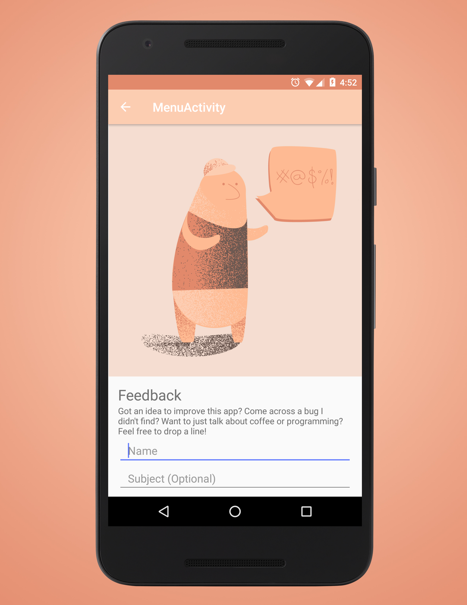

#Coffee Companion
=======================

This application aims to be a reference for brewing coffee using various brew methods. 
The app also includes hand drawn images, and methods for feedback and support.

## Project Setup
The project was created using Android Studio and the gradle build system.

## Screenshots

## Contributors
* Patrick Rice